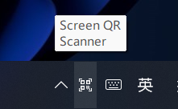

# ScreenQRScanner

A tool for scanning qr code on the screen.

## How to use?

Run the application, double-click the icon in the system tray. You will get the result.



It's better to limit Xmx to 64M.

```shell
javaw -Xmx1M -Xmx64M -jar ScreenQRScanner.jar
```